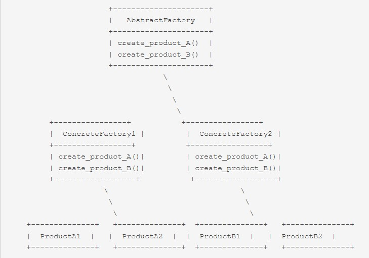

# Design pattern

## 1.1  单例模式：
- 让你能够保证一个类只有一个实例， 并提供一个访问该实例的全局节点。
- 实现方式：隐藏构造函数并实现一个静态的构建方法即可；
- 相同的类在多线程环境中会出错，多线程可能会同时调用构建方法并获取多个单例类的实例；

## 2 工厂模式
## 2.1 简单工厂模式
- 简单工厂模式专门定义一个类来负责创建其他类的实例；
- 创建的实例通常都具有共同的父类；
- 简单工厂模式是工厂模式家族中最简单实用的模式；
- 简单工厂模式通常被用于创建具有相似特征的对象，例如不同类型的图形对象、不同类型的数据库连接对象等。

## 2.2 工厂方法模式
- 抽象基类的定义方式
- 创建型设计模式，它提供了一种将对象的创建过程委托给子类的方式。
- 工厂方法模式使用一个接口或抽象类来表示创建对象的工厂，然后将具体的创建逻辑委托给子类来实现；

## 3 抽象工厂模式

- 种创建型设计模式， 它能创建一系列相关的对象， 而无需指定其具体类。
- 抽象工厂定义了用于创建不同产品的接口， 但将实际的创建工作留给了具体工厂类;
- 每个工厂类型都对应一个特定的产品变体;
- 客户端代码调用的是工厂对象的构建方法， 而不是直接调用构造函数 （ new操作符）。
- 由于一个工厂对应一种产品变体， 因此它创建的所有产品都可相互兼容
- 客户端代码仅通过其抽象接口与工厂和产品进行交互。 该接口允许同一客户端代码与不同产品进行交互。
- 你只需创建一个具体工厂类并将其传递给客户端代码即可.

## 4 迭代器模式
- 迭代器是一种行为设计模式， 让你能在不暴露复杂数据结构内部细节的情况下遍历其中所有的元素。
- 该模式在 Python 代码中很常见。 许多框架和程序库都使用它来提供遍历其集合的标准方式。
- 迭代器可以通过导航方法 （例如 next和 previous等） 来轻松识别。

## 5 适配器模式
- 适配器是一种结构型设计模式， 它能使不兼容的对象能够相互合作；
- 适配器可担任两个对象间的封装器， 它会接收对于一个对象的调用， 并将其转换为另一个对象可识别的格式和接口。

## 6 观察者模式
- 观察者模式是一种行为设计模式， 允许你定义一种订阅机制， 可在对象事件发生时通知多个 “观察” 该对象的其他对象；
- 遍历订阅者并调用其对象的特定通知方法;
- 提供了一种作用于任何实现了订阅者接口的对象的机制， 可对其事件进行订阅和取消订阅；
- 该模式可以通过将对象存储在列表中的订阅方法， 和对于面向该列表中对象的更新方法的调用来识别。

# 参考文献
[设计模式1](https://refactoringguru.cn/design-patterns/python)
[设计模式2](https://www.modb.pro/db/634285)
[设计模式2](https://baijiahao.baidu.com/s?id=1758410771062793648&wfr=spider&for=pc)
